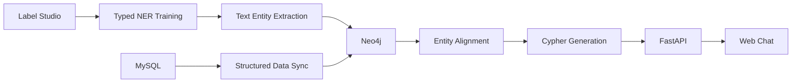

# EC Knowledge Graph

一个面向电商问答场景的知识图谱项目，围绕商品分类、品牌、SPU、SKU、平台属性和商品描述文本，构建了从数据标注、实体识别、实体标准化、图谱写入到问答服务的完整链路。

项目聚焦两个核心目标：

- 将 MySQL 中的结构化商品数据同步到 Neo4j，形成可查询的知识图谱
- 从商品文本中抽取可用于检索和问答的关键信息，并结合图谱完成自然语言问答

## 项目亮点

- 基于 BERT 的中文商品文本实体识别
- 面向电商文本的 4 类结构化知识抽取：`CAT / ATTR / PEOPLE / SPEC`
- 轻量标准化模块，支持同义词、人群、规格归一
- MySQL 到 Neo4j 的知识图谱构建流程
- 基于全文索引和向量索引的实体对齐
- 基于 LLM 的 Cypher 生成与问答编排
- FastAPI + Web 页面提供在线问答入口

## 技术栈

- Python 3.11+
- FastAPI + Uvicorn
- PyTorch
- Transformers / Datasets / Evaluate / SeqEval
- MySQL
- Neo4j
- LangChain
- DeepSeek API
- HuggingFace Embedding
- Label Studio

## 总体架构



## 实体标签设计

项目中的文本实体采用 4 类标签：

- `CAT`：商品核心名、品类短语
- `ATTR`：属性、功效、材质、风格
- `PEOPLE`：适用人群
- `SPEC`：规格、数值、型号

训练标签集合为：

- `O`
- `B-CAT` / `I-CAT`
- `B-ATTR` / `I-ATTR`
- `B-PEOPLE` / `I-PEOPLE`
- `B-SPEC` / `I-SPEC`

## 项目结构

```text
ec_graph/
├── data/
│   ├── gmall.sql
│   └── ner/
│       └── raw/
├── src/
│   ├── configuration/
│   │   ├── config.py
│   │   └── entity_normalization.json
│   ├── datasync/
│   │   ├── schema_sync.py
│   │   ├── table_sync.py
│   │   ├── text_sync.py
│   │   └── utils.py
│   ├── ner/
│   │   ├── preprocess.py
│   │   ├── train.py
│   │   ├── eval.py
│   │   ├── metrics.py
│   │   ├── normalization.py
│   │   └── predict.py
│   └── web/
│       ├── app.py
│       ├── service.py
│       ├── schemas.py
│       ├── utils.py
│       └── static/
├── .env.example
├── requirements.txt
└── README.md
```

## 核心流程

### 1. 文本抽取流程

1. 使用 Label Studio 标注商品文本
2. 将标注数据导出到 `data/ner/raw/data.json`
3. 运行 `src/ner/preprocess.py` 生成训练数据
4. 运行 `src/ner/train.py` 训练中文 NER 模型
5. 运行 `src/ner/eval.py` 输出整体和分类型指标
6. 运行 `src/datasync/text_sync.py` 抽取、标准化并写入 Neo4j

### 2. 图谱构建流程

1. 使用 `data/gmall.sql` 初始化 MySQL 业务库
2. 运行 `src/datasync/schema_sync.py` 创建 Neo4j 约束
3. 运行 `src/datasync/table_sync.py` 同步结构化业务数据
4. 运行 `src/datasync/text_sync.py` 同步文本侧实体节点
5. 运行 `src/web/utils.py` 构建全文索引和向量索引

### 3. 问答流程

1. 用户输入自然语言问题
2. 服务执行实体对齐
3. LLM 基于图谱 schema 生成参数化 Cypher
4. Neo4j 执行查询
5. LLM 基于查询结果生成自然语言答案

## 标准化策略

文本实体在写入图谱前会经过轻量标准化处理，主要包括：

- 词典映射
- 同义词归一
- 人群归一
- 规格格式归一

标准化配置位于：

```text
src/configuration/entity_normalization.json
```

## 图谱中的文本实体节点

商品文本抽取结果会写入以下节点类型：

- `CategoryTag`
- `AttributeTag`
- `PeopleTag`
- `SpecTag`

并通过 `(:SPU)-[:Have]->(:TagNode)` 的关系与商品连接。

## 环境配置

复制配置文件：

```powershell
Copy-Item .env.example .env
```

`.env` 中至少需要配置：

- `MYSQL_HOST`
- `MYSQL_PORT`
- `MYSQL_USER`
- `MYSQL_PASSWORD`
- `MYSQL_DATABASE`
- `NEO4J_URI`
- `NEO4J_USER`
- `NEO4J_PASSWORD`
- `DEEPSEEK_API_KEY`
- `DEEPSEEK_MODEL`
- `EMBEDDING_MODEL_NAME`

## 从零启动

### 1. 创建环境并安装依赖

```powershell
python -m venv .venv
.venv\Scripts\Activate.ps1
python -m pip install --upgrade pip
pip install -r requirements.txt
Copy-Item .env.example .env
```

### 2. 初始化数据库

先启动本地 MySQL 和 Neo4j，然后导入 SQL：

```powershell
mysql -u root -p < data\gmall.sql
```

如果 PowerShell 对重定向兼容不好，可以改成：

```powershell
Get-Content data\gmall.sql | mysql -u root -p
```

### 3. 准备标注数据

训练数据默认读取：

```text
data/ner/raw/data.json
```

实体标签需要使用：

- `CAT`
- `ATTR`
- `PEOPLE`
- `SPEC`

### 4. 预处理、训练、评估

```powershell
python src\ner\preprocess.py
python src\ner\train.py
python src\ner\eval.py
```

模型输出目录：

```text
checkpoints/ner/best_model
```

### 5. 构建知识图谱

```powershell
python src\datasync\schema_sync.py
python src\datasync\table_sync.py
python src\datasync\text_sync.py
```

### 6. 创建检索索引

```powershell
python src\web\utils.py
```

### 7. 启动问答服务

```powershell
python src\web\app.py
```

访问地址：

```text
http://127.0.0.1:8000/
```

## 推荐执行顺序

1. `Copy-Item .env.example .env`
2. 填写 `.env`
3. 启动 MySQL 和 Neo4j
4. `mysql -u root -p < data\gmall.sql`
5. 准备 `data/ner/raw/data.json`
6. `python src\ner\preprocess.py`
7. `python src\ner\train.py`
8. `python src\ner\eval.py`
9. `python src\datasync\schema_sync.py`
10. `python src\datasync\table_sync.py`
11. `python src\datasync\text_sync.py`
12. `python src\web\utils.py`
13. `python src\web\app.py`

## 常见问题

### 1. `preprocess.py` 报不支持标签

训练数据中的实体标签需要是：

- `CAT`
- `ATTR`
- `PEOPLE`
- `SPEC`

### 2. `text_sync.py` 提示找不到模型

先执行：

```powershell
python src\ner\preprocess.py
python src\ner\train.py
```

### 3. Neo4j 索引创建失败

优先检查：

- Neo4j 版本是否支持全文索引和向量索引
- 当前账号是否有建索引权限
- 文本实体节点是否已经成功写入

### 4. 页面可以打开，但问答没有结果

优先检查：

- DeepSeek API Key 是否有效
- Neo4j 中是否已经完成数据同步和索引创建
- 问题涉及的实体是否存在于图谱中
