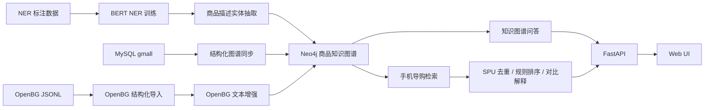

# EC Graph Dialogue System

EC Graph Dialogue System 是一个面向电商场景的知识图谱问答与任务型导购对话项目。项目从商品数据同步、文本实体抽取、Neo4j 图谱构建开始，向上提供两类应用能力：

- 知识图谱问答：自然语言问题 -> 实体对齐 -> Cypher 生成 -> Neo4j 查询 -> 答案生成。
- 多轮手机导购：意图识别 -> 槽位填充 -> 对话状态跟踪 -> 缺槽追问 -> 图谱约束检索 -> 候选排序与解释。

项目重点不是让大模型直接“编推荐”，而是把 LLM 放在语义理解和回复表达环节，商品过滤、价格约束、在售判断和候选排序由图谱查询和确定性逻辑控制。

## Features

- 基于 BERT 的中文商品文本 NER，当前实体类型为 `ATTR`、`PEOPLE`、`SPEC`。
- 支持从 MySQL `gmall` 数据同步商品、类目、品牌、SKU、属性等结构化节点到 Neo4j。
- 支持导入 OpenBG 中文商品数据，用于扩充图谱中的商品、类目、属性和文本实体。
- 支持 Neo4j 全文索引与向量索引，用于知识图谱问答中的实体对齐。
- 支持手机品类的任务型多轮导购，包括预算、品牌、用途、存储等槽位。
- 提供 FastAPI 服务和 Web 页面，前端可在“导购对话”和“知识问答”两种模式之间切换。

## Architecture



## Core Modules

```text
src/
|-- configuration/
|   |-- config.py                  # 路径、模型、数据库、图谱标签与索引配置
|   `-- entity_normalization.json   # NER 实体归一化配置
|-- datasync/
|   |-- schema_sync.py              # Neo4j 约束与导购范围索引
|   |-- table_sync.py               # gmall 结构化表同步
|   |-- text_sync.py                # gmall 商品文本 NER 入图
|   |-- openbg_sync.py              # OpenBG 结构化数据入图
|   |-- openbg_text_sync.py         # OpenBG 描述生成与 NER 入图
|   `-- reset_graph.py              # 清空图谱辅助脚本
|-- dialogue/
|   |-- nlu.py                      # 意图识别与槽位抽取
|   |-- state.py                    # 会话状态存储
|   |-- retrieval.py                # 手机候选检索、排序、对比
|   |-- service.py                  # 多轮导购流程编排
|   `-- types.py                    # 对话状态、推荐项、NLU 结果定义
|-- ner/
|   |-- preprocess.py               # NER 数据预处理
|   |-- train.py                    # NER 模型训练
|   |-- eval.py                     # NER 模型评估
|   |-- predict.py                  # NER 推理
|   `-- normalization.py            # 实体归一化
`-- web/
    |-- app.py                      # FastAPI 入口
    |-- service.py                  # 知识图谱问答服务
    |-- schemas.py                  # API 请求/响应结构
    |-- utils.py                    # 全文/向量索引构建
    `-- static/index.html           # Web 页面
```

## Dialogue Scope

当前多轮导购链路聚焦手机品类，适合演示任务型对话系统的核心流程。

支持的槽位：

| Slot | 说明 | 示例 |
| --- | --- | --- |
| `budget_max` | 最高预算 | `3000以内`、`4k`、`预算5000` |
| `use_case` | 主要需求 | `拍照`、`游戏`、`续航`、`性价比` |
| `brand` | 品牌偏好 | `苹果`、`华为`、`OPPO`、`小米` |
| `storage` | 机身存储 | `128G`、`256G`、`512G` |

一次典型对话：

```text
用户：想买手机，4k
系统：你更看重哪一方面？我这边先支持拍照、游戏、续航、性价比四种诉求。

用户：主要拍照
系统：返回符合预算和用途的在售候选，并解释推荐理由。

用户：苹果 256G
系统：如果预算不足，会提示当前在售 Apple 手机的可行价格，并等待用户确认是否放宽预算。

用户：帮我筛一下吧
系统：按更新后的预算继续检索候选。

用户：把前两个比一下
系统：基于上一轮推荐结果，从价格、品牌、存储和用途匹配度进行对比。
```

边界说明：

- 多轮导购当前只覆盖手机品类，检索入口限定在手机 `Category3`。
- 非手机导购问题会尝试 fallback 到知识图谱问答。
- `storage` 表示机身存储，不与运行内存混用。
- 推荐结果以 `SPU` 维度去重，避免同一机型不同颜色重复占位。

## LLM Usage

项目采用“规则可控 + LLM 增强”的方式：

- 导购 NLU：规则优先；当规则不够确定时，可调用 LLM 抽取 `intent` 和槽位。
- 导购回复：先生成确定性的基础回复，再由 LLM 做自然语言润色。
- 知识问答：LLM 用于生成参数化 Cypher 和最终自然语言答案。

LLM 不直接决定商品集合、价格过滤、在售过滤或最终排序，避免推荐结果不可控。

如果没有配置 `DEEPSEEK_API_KEY`：

- `/api/dialogue/chat` 仍可用于手机导购，使用规则 NLU 和固定回复。
- `/api/chat` 知识问答不可用，接口会返回 `503`。

## Requirements

- Python 3.10+
- MySQL 8.x
- Neo4j 5.x
- 可选：GPU 环境用于 NER 训练

安装依赖：

```powershell
python -m venv .venv
.venv\Scripts\Activate.ps1
python -m pip install --upgrade pip
pip install -r requirements.txt
```

复制环境变量模板：

```powershell
Copy-Item .env.example .env
```

`.env` 主要配置项：

```env
MYSQL_HOST=localhost
MYSQL_PORT=3306
MYSQL_USER=root
MYSQL_PASSWORD=your_mysql_password
MYSQL_DATABASE=gmall

NEO4J_URI=neo4j://localhost:7687
NEO4J_USER=neo4j
NEO4J_PASSWORD=your_neo4j_password

DEEPSEEK_API_KEY=your_deepseek_api_key
DEEPSEEK_MODEL=deepseek-chat
EMBEDDING_MODEL_NAME=BAAI/bge-base-zh-v1.5
```

## Quick Start

如果只想体验手机导购，最小流程是导入 `gmall.sql`，同步主图谱，然后启动 Web 服务。

### 1. 初始化 MySQL

```powershell
mysql -u root -p gmall < data\gmall.sql
```

如果数据库不存在，可以先创建：

```sql
CREATE DATABASE gmall DEFAULT CHARACTER SET utf8mb4;
```

### 2. 构建 Neo4j 图谱

```powershell
python src\datasync\schema_sync.py
python src\datasync\table_sync.py
```

### 3. 启动服务

```powershell
python src\web\app.py
```

访问：

```text
http://127.0.0.1:8000/
```

进入页面后切换到“导购对话”模式，可以尝试：

```text
想买手机，4k
主要拍照
苹果 256G
帮我筛一下吧
把前两个比一下
```

## Full Data Pipeline

完整链路包括 NER、gmall 主图谱、OpenBG 扩图和检索索引。

### 1. NER 训练与评估

```powershell
python src\ner\preprocess.py
python src\ner\train.py
python src\ner\eval.py
```

NER 标签类型配置在 `src/configuration/config.py`，当前为：

```text
ATTR, PEOPLE, SPEC
```

### 2. gmall 主图谱同步

```powershell
python src\datasync\schema_sync.py
python src\datasync\table_sync.py
python src\datasync\text_sync.py
```

`table_sync.py` 会同步商品、SKU、类目、品牌、平台属性、销售属性等结构化节点与关系。`text_sync.py` 会对商品描述运行 NER，并写入 `AttributeTag`、`PeopleTag`、`SpecTag`。

### 3. OpenBG 扩图

```powershell
python src\datasync\openbg_sync.py
python src\datasync\openbg_text_sync.py
```

OpenBG 导入策略：

- 每条 OpenBG 样本映射为一个 `SPU` 和一个默认 `SKU`。
- 类目优先匹配已有 `Category3`，不稳定时回退到 `Category2` 并创建新的 `Category3`。
- `item_pvs` 默认写入平台属性，`sku_pvs` 中白名单属性写入销售属性。
- 文本增强阶段生成中文描述，再运行 NER 写入文本实体节点。

### 4. 构建问答索引

```powershell
python src\web\utils.py
```

该步骤会为配置中的实体类型创建全文索引和向量索引，用于知识问答中的实体对齐。

## API

### 手机导购

```http
POST /api/dialogue/chat
Content-Type: application/json
```

请求：

```json
{
  "message": "想买手机，预算5000，主要拍照",
  "session_id": null
}
```

响应字段：

```json
{
  "session_id": "session-id",
  "message": "回复文本",
  "mode": "dialogue",
  "action": "recommend",
  "state": {
    "domain": "phone_guide",
    "intent": "recommend",
    "filled_slots": {
      "budget_max": 5000,
      "use_case": "拍照"
    },
    "pending_slots": []
  },
  "recommendations": [
    {
      "sku_id": 1,
      "spu_id": 1,
      "sku_name": "SKU 名称",
      "spu_name": "SPU 名称",
      "brand": "品牌",
      "price": 4999,
      "reason": "推荐理由",
      "default_img": "",
      "storage_options": ["128G", "256G"]
    }
  ]
}
```

`action` 可能值：

- `ask_slot`：需要继续追问槽位。
- `recommend`：返回推荐候选。
- `compare`：对上一轮候选做对比。
- `fallback_qa`：转入知识图谱问答。
- `reset`：清空当前会话条件。

### 知识图谱问答

```http
POST /api/chat
Content-Type: application/json
```

请求：

```json
{
  "message": "Apple 都有哪些产品？"
}
```

响应：

```json
{
  "message": "答案文本"
}
```

## Development

运行单元测试：

```powershell
python -m unittest discover tests
```

常用调试命令：

```powershell
python src\datasync\reset_graph.py
python src\datasync\schema_sync.py
python src\datasync\table_sync.py
python src\web\app.py
```

如果只想验证导购模块的 Python 语法：

```powershell
python -m py_compile src\dialogue\__init__.py src\dialogue\types.py src\dialogue\state.py src\dialogue\nlu.py src\dialogue\retrieval.py src\dialogue\service.py
```

## Known Limitations

- 多轮导购目前是手机品类 demo，没有实现全品类路由。
- 会话状态使用内存存储，服务重启后会丢失；生产环境应替换为 Redis 或数据库。
- 导购排序以规则分数为主，没有接入学习排序模型。
- 商品属性质量直接影响存储、用途等条件过滤效果。
- 知识问答依赖 LLM 生成 Cypher，实际生产环境需要更严格的查询模板、权限控制和安全校验。

