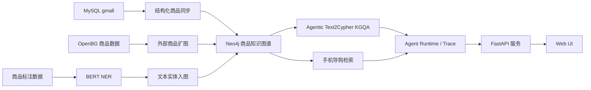

# 电商知识图谱问答与任务型导购对话系统

一套端到端 LLM + 知识图谱应用系统，围绕三条主链路展开：

- **Agentic Text2Cypher for KGQA**：将自然语言问题转换为工具计划、参数化 Cypher 与待对齐实体槽
- **Hybrid Retrieval for Entity Linking**：Neo4j 全文索引 + `bge-base-zh` 稠密向量检索，做口语化实体到图谱标准实体的对齐
- **Controllable Task-Oriented Dialogue**：围绕手机导购实现规则可控、图谱约束的多轮对话系统

系统以 Neo4j 商品知识图谱为事实底座，LLM 用于复杂语义理解、结构化查询生成和自然语言表达，商品事实、价格过滤、在售判断和推荐候选由图谱查询与确定性逻辑约束。完整复现步骤见 [`REPRODUCTION_GUIDE.md`](REPRODUCTION_GUIDE.md)。

## TL;DR

- **KGQA 分阶段评测**：`full` vs. `ablation`（去掉实体对齐）在 `non_empty_result_rate` 上 `+20.5 pts`，在 `answer_keyword_hit_rate` 上 `+15.8 pts`
- **实体链接评测**：`hybrid` vs. `fulltext` 在 top-1 accuracy 上 `+13.0 pts`，top-k recall 上 `+14.3 pts`
- **多轮导购评测**：`30` 条状态机 / 工具调用回归集上 `task_success_rate=100%`；真实单轮 NLU 诊断集 `intent_accuracy=90%`、`slot_f1=100%`；真实 smoke 联调 `5/5` 通过
- **NER 数据策略迭代**：`ATTR F1 +13.5 pts`，`overall F1 +8.0 pts`，同时识别出 `SPEC` 作为独立补强方向
- **可控性优先**：LLM 不直接决定商品事实与排序；结构化输出有 `json_repair` 修复，Cypher 执行前经过只读安全门禁；导购 NLU 规则优先、LLM 兜底
- **可观测性**：`ExecutionTrace` 持久化 Agent 工具计划、工具调用、失败标签和延迟；`trace_chat()` 继续兼容旧评测字段

## 项目定位

项目涵盖从数据构建到线上服务的端到端链路：

- 商品文本理解：从商品标题和描述中抽取属性、人群和规格实体
- 知识图谱构建：将结构化商品数据、外部商品数据和文本实体统一写入 Neo4j
- 知识图谱问答：通过工具规划、实体对齐、Cypher 生成和图查询完成自然语言问答
- 任务型导购对话：围绕手机品类实现 NLU、DST、缺槽追问、图约束检索、排序和对比解释

核心技术标签：`Agent Runtime` | `Text2Cypher` | `Hybrid Entity Linking` | `Controllable TOD` | `Schema-grounded Structured Generation` | `Span-level NER Error Analysis` | `Staged KGQA Evaluation`

## 关键结果

| 任务 | 指标 | baseline | 本项目 | Δ |
| --- | --- | --- | --- | ---: |
| KGQA | non-empty result rate | ablation 0.6842 | full 0.8947 | **+20.5 pts** |
| KGQA | answer keyword hit rate | ablation 0.6842 | full 0.8421 | **+15.8 pts** |
| KGQA | entity all coverage rate | ablation 0.6923 | full 0.8974 | **+20.5 pts** |
| Entity Linking | top-1 accuracy | fulltext 0.7532 | hybrid 0.8831 | **+13.0 pts** |
| Entity Linking | top-k recall | fulltext 0.7922 | hybrid 0.9351 | **+14.3 pts** |
| Dialogue Eval | task success rate | - | `30` 条回归任务 `1.0000` | - |
| Dialogue Eval | intent accuracy | - | 真实 NLU 诊断 `0.9000` | - |
| Dialogue Eval | slot F1 | - | 真实 NLU 诊断 `1.0000` | - |
| Dialogue Eval | smoke pass rate | - | `5/5` 通过 | - |
| NER（数据策略迭代） | ATTR F1 | 初版 0.6077 | 当前 0.7425 | **+13.5 pts** |
| NER（数据策略迭代） | overall F1 | 初版 0.6449 | 当前 0.7248 | +8.0 pts |
| NER（数据策略迭代） | SPEC F1 | 初版 0.6683 | 当前 0.5210 | -14.7 pts（已识别为补强方向） |

- KGQA `template` baseline 在当前图谱事实下达到 1.0000，作为可执行上限参考
- KGQA 评测集 `39` 条（`must_execute=38`），Entity Linking 评测集 `77` 条
- 导购评测集：主回归任务 `30` 条、NLU 诊断样本 `10` 条、smoke case `5` 条
- 结果数据源：`logs/eval/`，评测脚本：`src/eval/kgqa_eval.py`、`src/eval/entity_linking_eval.py`、`src/eval/dialogue_eval.py`、`src/eval/dialogue_nlu_eval.py`、`src/eval/dialogue_smoke.py`

## 系统架构



## 三条核心技术链路

### 1. Text2Cypher KGQA

```text
用户问题 -> 工具规划 -> 实体对齐 -> Cypher 校验 -> Neo4j 查询 -> 答案生成
```

范式定位：

- `Text2Cypher`：LLM 将自然语言转换为工具计划、参数化 Cypher 和实体槽
- `Schema-grounded Structured Generation`：输出结构受真实图谱 schema 约束
- `Hybrid Retrieval for Entity Linking`：将口语化实体对齐到图谱标准实体

关键设计：

- Cypher 输出必须使用参数化占位符（`$param_0` 等）
- `tool_plan` 显式声明 `entity_link_tool`、`graph_query_tool`、`answer_tool` 等执行步骤
- 待对齐实体单独输出到 `entities_to_align`，与最终查询结构解耦，便于独立评测 entity linking
- `label` 字段只能来自真实图谱节点标签，避免幻觉标签进入执行链
- Cypher 执行前经过 `CypherGuard`，做多语句拦截、写操作关键字拦截、`LIMIT` 约束和可选 `EXPLAIN` 校验
- LLM 只生成查询结构与答案文本，不直接决定图谱事实

### 2. Hybrid Entity Linking

项目把实体对齐单独拆出来评测，不是混在最终问答指标里。当前评测集 `77` 条样本，覆盖 `Trademark`、`SPU`、`SKU`、`Category3`，固定在"给定正确 label 条件下"比较三组 baseline：

| baseline | total | top-1 accuracy | top-k recall |
| --- | ---: | ---: | ---: |
| `exact_match` | 77 | 0.2597 | 0.2597 |
| `fulltext` | 77 | 0.7532 | 0.7922 |
| `hybrid` | 77 | **0.8831** | **0.9351** |

结论：

- `exact_match` 远不够，说明用户表达与图谱标准名之间存在大量格式与表述差异
- `hybrid`（BM25 + dense vector）明显优于纯全文检索，是当前线上默认对齐策略的合理选择
- `Trademark` 和 `SPU` 的对齐最稳定；`SKU` 仍是最难实体，原因是名称长、版本差异细、近邻 SKU 相似度高

### 3. 可控任务型导购对话

```text
NLU -> Dialogue State -> 缺槽追问 -> Neo4j 图约束检索 -> SPU 去重 -> 候选排序 -> 推荐解释
```

支持槽位：

| 槽位 | 含义 | 示例 |
| --- | --- | --- |
| `budget_max` | 最高预算 | `3000以内`、`4k`、`预算5000` |
| `use_case` | 购机场景 | `拍照`、`游戏`、`续航`、`性价比` |
| `brand` | 品牌偏好 | `苹果`、`华为`、`OPPO`、`小米` |
| `storage` | 机身存储 | `128G`、`256G`、`512G` |

示例对话：

```text
用户：想买手机，4k
系统：你更看重哪一方面？我这边先支持拍照、游戏、续航、性价比四种诉求。
用户：主要拍照
系统：返回符合预算和用途的在售候选，并解释推荐理由。
用户：苹果 256G
系统：如果当前预算不足，会提示 Apple 在售机型的可行价格，并询问是否放宽预算。
用户：帮我筛一下吧
系统：按更新后的预算继续检索候选。
用户：把前两个比一下
系统：基于上一轮推荐结果，从价格、品牌、存储和用途匹配度进行对比。
```

导购结果来自 Neo4j 中真实在售 SKU，并按 SPU 维度去重，避免同一机型不同变体重复占位。

导购链路仍由 `DialogueService` 负责状态机和缺槽追问，但底层商品检索、候选对比和价格下限查询已经包装为 Agent Tool，与 KGQA 共用运行时 trace 机制。

当前导购评测分为三层：

- `dialogue_eval.py`：`StubNLU + FixtureRetriever` 的状态机 / 工具调用回归集
- `dialogue_nlu_eval.py`：真实 `DialogueNLU.parse()` 的单轮诊断集
- `dialogue_smoke.py`：真实 Neo4j + 真实 LLM 的少量 smoke 联调

## LLM 能力边界矩阵

| 触点 | 输入 | 输出结构 | 是否决定事实 | 兜底 |
| --- | --- | --- | --- | --- |
| KGQA 工具规划 | 问题 + schema + 最近历史 | `JSON(tool_plan, cypher_query, entities_to_align)` | 否，受 schema、工具白名单与查询执行约束 | `json_repair` 修复 → 默认工具计划 / 模板 Cypher 兜底 |
| KGQA 答案生成 | 问题 + 查询结果 + 最近历史 | 自然语言文本 | 否，只基于图查询结果表达 | 无结果时固定说明；LLM 缺席时回落 JSON dump |
| 导购 NLU | 用户话术 | `intent + slots` | 否，规则优先，LLM 仅做复杂语义兜底 | 规则 NLU |
| 导购回复润色 | 基础回复 + context | 自然语言文本 | 否，不改结论、不造商品 | 异常时返回 fallback 文本 |

## Prompt 设计

KGQA Prompt 不是自由生成，而是围绕明确输入和输出契约设计。当前规划器输出的不只是 Cypher，还包括可执行的工具计划。

**Cypher 生成输入：**

- `question`：当前用户问题
- `graph.schema`：Neo4j 自动导出的 schema 信息
- `recent_history`：通过 `_format_history()` 压缩的最近对话文本

**输出契约（严格 JSON）：**

```json
{
  "tool_plan": [
    {"tool_name": "entity_link_tool", "arguments": {"mode": "hybrid", "top_k": 3}},
    {"tool_name": "graph_query_tool", "arguments": {"timeout_ms": 2000}},
    {"tool_name": "answer_tool", "arguments": {}}
  ],
  "cypher_query": "MATCH (t:Trademark {name: $param_0})<-[:Belong]-(spu:SPU) RETURN spu.name",
  "entities_to_align": [
    {"param_name": "param_0", "entity": "苹果", "label": "Trademark"}
  ]
}
```

**硬约束：**

- `cypher_query` 只能使用参数化占位符，不允许把实体值直接拼进 Cypher
- `tool_plan.tool_name` 必须来自已注册的 KGQA 工具白名单
- `label` 必须 ∈ 真实 schema 节点标签
- 不需要对齐时 `entities_to_align` 显式返回 `[]`
- 历史只用于恢复指代，不允许编造历史中不存在的实体或约束

**答案 Prompt 两条红线：**

- 图结果为空时明确说明"当前图谱中没有找到相关信息"
- 不允许编造查询结果中不存在的事实

## KGQA 分阶段评测

评测不是只看最终回答，而是按链路阶段拆解：JSON 解析成功率 / Cypher 可执行率 / 结果非空率 / 答案关键词命中率 / 实体覆盖率 / 危险 Cypher 检测率。评测集位于 `data/eval/kgqa.jsonl`，共 `39` 条样本，其中 `must_execute=true` 的样本 `38` 条。

| baseline | total | non_empty_result_rate | answer_keyword_hit_rate | entity_all_coverage_rate |
| --- | ---: | ---: | ---: | ---: |
| `template` | 39 | 1.0000 | 1.0000 | 1.0000 |
| `full` | 39 | **0.8947** | **0.8421** | **0.8974** |
| `ablation` | 39 | 0.6842 | 0.6842 | 0.6923 |

结论：

- `template` 已和当前图谱事实对齐，是可执行上限参考
- `full` 明显优于 `ablation`，说明实体对齐对"查询非空"和"答案命中"都有显著贡献
- 当前 KGQA 剩余误差主要集中在实体覆盖和查询生成，而不是 JSON 解析或 Cypher 执行
- 结构化输出与执行链路已经较稳定，问题收敛到语义层

## 中文商品 NER

NER 抽取 3 类实体：

| 标签 | 含义 | 示例 |
| --- | --- | --- |
| `ATTR` | 可结构化、可检索的属性值 | `控油`、`无硅油`、`纯棉`、`复古` |
| `PEOPLE` | 适用对象或人群 | `儿童`、`学生`、`女士`、`男宝宝` |
| `SPEC` | 规格、容量、型号、组合表达 | `256GB`、`60粒`、`A3294`、`12GB+256GB` |

span-level error analysis 产物在 `logs/ner/`（`ner_error_summary.json` / `ner_confusion.csv` / `ner_bad_cases.jsonl`）。当前错误分布：

| 错误类型 | 占比 |
| --- | ---: |
| spurious | 41.4% |
| missing | 34.1% |
| boundary_mismatch | 21.0% |
| type_mismatch | 2.1% |
| boundary_and_type_mismatch | 1.4% |

主要瓶颈在边界和召回，不是类型判断。数据迭代策略：收紧 `ATTR` 只保留可结构化属性值、拆分连续属性、排除低信息量修饰词、保留 `SPEC` 规格串整体性。结果是 `ATTR F1 +13.5 pts`、`overall F1 +8.0 pts`，但 `SPEC F1 -14.7 pts` —— 新规则抑制了泛化 `ATTR`，同时削弱了对弱格式规格表达的召回。后续 `SPEC` 作为独立方向继续补强。

更详细的数据策略权衡见 [`REPRODUCTION_GUIDE.md`](REPRODUCTION_GUIDE.md)。

## Controllability & Failure Handling

把可控性和失效处理作为系统设计的一部分，而不是事后补丁：

- **JSON 解析失败**：先尝试原始 JSON 解析，失败后用 `json_repair` 二次修复，原始成功率与修复后成功率分别统计
- **工具计划兜底**：未知工具名、缺失工具计划或异常参数不会直接进入执行链，会记录 `plan_schema_invalid` 并退回默认工具计划或模板 Cypher
- **危险 Cypher 阻断**：`CypherGuard` 对多语句、写操作关键字、非参数化字符串条件和超大 `LIMIT` 做执行前校验，必要时通过 `EXPLAIN` 交给 Neo4j 校验语法和 schema
- **实体对齐兜底**：检索未命中时，保留 LLM 原始实体值继续执行下游 Cypher
- **导购无结果处理**：存储条件可放宽回退；品牌超预算场景进入 `awaiting_budget_confirmation` 状态机
- **LLM 不可用降级**：`DEEPSEEK_API_KEY` 缺失时，导购链路仍可运行（规则 NLU + 固定回复），KGQA 返回 503

## 可观测性

`ExecutionTrace` 是当前 Agent 运行的单一事实源。每次 `/api/agent/chat` 和导购工具调用都会记录工具计划、工具入参/出参、失败标签、质量信号、fallback 和延迟，并落盘到 `logs/traces/<date>/<trace_id>.json`。

旧评测脚本仍通过 `ChatService.trace_chat()` 获取扁平字段；这些字段现在由 `ExecutionTrace` 投影而来，便于保持历史评测口径稳定。

**评测指标依赖字段：**

- `parse_success_raw`、`parse_success_repaired`
- `cypher_query_present`
- `execution_success`、`non_empty_result`
- `unsafe_cypher`

**排障诊断字段：**

- `raw_cypher_output`、`repaired_cypher_output`
- `entities_to_align`、`aligned_entities`、`executed_params`
- `execution_error`、`query_result`、`answer`

**Agent API：**

- `POST /api/agent/chat`：返回答案、`trace_id`、工具计划摘要、延迟和 fallback 信息
- `GET /api/agent/traces/{trace_id}`：按 trace id 查看完整执行轨迹
- `GET /api/agent/traces?session_id=...`：按会话查看 trace 列表
- `POST /api/agent/replay`：读取并返回已持久化 trace；当前不是重新执行不同 runtime 的完整 replay 评测框架

## 技术栈

- 语言与服务：`Python`、`FastAPI`
- 深度学习与 NLP：`PyTorch`、`Transformers`、`BERT Token Classification`
- 图数据库与检索：`Neo4j`（fulltext index + vector index + HYBRID search）
- 关系型数据源：`MySQL`
- LLM 与框架：`LangChain`、`DeepSeek API`
- 稠密向量模型：`BAAI/bge-base-zh-v1.5`
- 前端展示：Web Demo

## 核心模块

| 模块 | 说明 |
| --- | --- |
| `src/agent/` | Agent Runtime、工具编排、CypherGuard、ExecutionTrace 和工具实现 |
| `src/ner/` | NER 数据预处理、训练、评估、推理和错误分析 |
| `src/datasync/` | MySQL / OpenBG 到 Neo4j 的图谱同步 |
| `src/dialogue/` | 导购 NLU、会话状态、检索排序、对比和流程编排 |
| `src/web/` | FastAPI 服务、知识问答兼容层、Agent API、索引构建和前端页面 |
| `src/eval/` | 实体链接评测、KGQA 分阶段评测与日志输出 |
| `src/configuration/` | 路径、模型、标签、数据库和图谱索引配置 |

## 快速体验

完整复现流程见 [`REPRODUCTION_GUIDE.md`](REPRODUCTION_GUIDE.md)。手机导购最小运行流程：

```powershell
python src\datasync\schema_sync.py
python src\datasync\table_sync.py
python src\web\app.py
```

访问：

```text
http://127.0.0.1:8000/
```

导购模式下可以输入：

```text
想买手机，4k
主要拍照
苹果 256G
帮我筛一下吧
把前两个比一下
```

KGQA / Agent 接口可以直接调用：

```http
POST /api/chat
POST /api/agent/chat
GET /api/agent/traces/{trace_id}
```

## 项目边界

**工程层面：**

- 多轮导购当前聚焦手机品类，不覆盖全品类导购
- 会话状态使用内存存储，生产环境可替换为 Redis 或数据库
- 导购排序以规则分数为主，没有使用在线反馈或学习排序
- `/api/agent/replay` 当前只是读取已持久化 trace，不是多 runtime 变体的重放评测
- 知识图谱问答依赖 LLM 生成工具计划和 Cypher，生产场景需要继续加强查询模板、安全校验、权限控制和审计

**算法与评测层面：**

- `SPEC` 规格类实体仍是当前 NER 的主要短板，尤其是型号、容量、范围、单位串和数字字母组合
- 当前 QA 评测集仍是小而全的种子集（KGQA 39 / Entity Linking 77），适合做链路验证与归因，不等同于成熟 benchmark
- 评测集由人工构造，未覆盖长尾口语化表述、跨类目推理和多跳查询场景
- `answer_keyword_hit_rate` 是弱代理指标，当前实现是大小写不敏感子串匹配，不能替代人工评测或 LLM-as-judge
