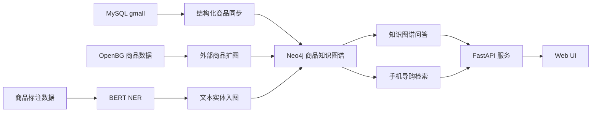

# 电商知识图谱问答与任务型导购对话系统

一个面向电商场景的 NLP 工程项目，围绕商品文本理解、知识图谱构建、知识图谱问答和任务型导购对话三条主链路展开。系统以 Neo4j 商品知识图谱为事实底座，结合中文商品 NER、实体对齐、意图识别、槽位填充、对话状态跟踪和图约束检索，提供可控、可解释的问答与导购能力。

完整复现步骤、环境配置、数据准备和 API 细节见 [`REPRODUCTION_GUIDE.md`](REPRODUCTION_GUIDE.md)。

## 项目定位

- 商品文本理解：从商品标题和描述中抽取属性、人群和规格实体
- 知识图谱构建：将结构化商品数据、外部商品数据和文本实体统一写入 Neo4j
- 知识图谱问答：通过实体对齐、Cypher 生成和图查询完成自然语言问答
- 任务型导购对话：围绕手机品类实现 NLU、DST、缺槽追问、图约束检索、排序和对比解释

项目强调工程可控性：LLM 用于复杂语义理解、Cypher 生成和自然语言表达，商品事实、价格过滤、在售判断和推荐候选由知识图谱与确定性逻辑约束。

## 专业能力

| 能力方向 | 项目体现 |
| --- | --- |
| 自然语言处理 | 中文商品 NER、实体归一化、实体对齐、问答与导购场景下的语义理解 |
| 任务导向型对话系统 | 意图识别、槽位填充、对话状态跟踪、缺槽追问、预算确认、候选比较 |
| 知识图谱相关技术 | 商品图谱建模、MySQL / OpenBG / 文本实体入图、Cypher 查询与图约束检索 |
| 语义检索与问答 | 全文索引、向量索引、实体对齐、图谱问答链路 |
| 误差分析与迭代 | span-level error analysis、bad case 归因、标注策略修正、重新训练 |
| 工程落地能力 | FastAPI、Web Demo、Neo4j、MySQL、数据同步脚本、评测与日志产物 |

## 项目亮点

- 用 `ATTR / PEOPLE / SPEC` 三类实体完成中文商品文本信息抽取，并将结果写回商品知识图谱
- 围绕手机导购实现了完整的任务型对话链路：`NLU -> DST -> 缺槽追问 -> 图约束检索 -> 排序 -> 对比解释`
- 问答链路基于 Neo4j 图查询完成，不让 LLM 直接决定商品事实和推荐结果
- NER 评估新增 span-level error analysis，形成“评测 -> bad case -> 标注策略修正 -> 重训”的闭环
- 当前 NER 版本在最新评测中达到：

| 指标 | 数值 |
| --- | ---: |
| overall precision | 0.7134 |
| overall recall | 0.7365 |
| overall F1 | 0.7248 |
| type-agnostic span F1 | 0.7366 |
| ATTR F1 | 0.7425 |
| PEOPLE F1 | 0.7886 |
| SPEC F1 | 0.5210 |

## 系统架构



## 核心技术链路

### 1. 中文商品 NER

NER 任务从商品标题和描述中抽取 3 类实体：

| 标签 | 含义 | 示例 |
| --- | --- | --- |
| `ATTR` | 可结构化、可检索的属性值 | `控油`、`无硅油`、`纯棉`、`复古` |
| `PEOPLE` | 适用对象或人群 | `儿童`、`学生`、`女士`、`男宝宝` |
| `SPEC` | 规格、容量、型号、组合表达 | `256GB`、`60粒`、`A3294`、`12GB+256GB` |

当前 NER 模块包含：

- 数据预处理、训练、评估和推理
- span-level error analysis
- bad case、类型混淆和错误分布统计

评测日志产物位于 `logs/ner/`：

- `ner_error_summary.json`：整体指标、错误类型分布、按实体类型统计
- `ner_confusion.csv`：实体类型混淆统计
- `ner_bad_cases.jsonl`：逐样本错误详情

当前错误分布表明，主要瓶颈集中在实体边界和召回质量，而不是单纯的类型判断：

| 错误类型 | 占比 |
| --- | ---: |
| spurious | 41.4% |
| missing | 34.1% |
| boundary_mismatch | 21.0% |
| type_mismatch | 2.1% |
| boundary_and_type_mismatch | 1.4% |

这说明当前 `ATTR` 整体效果较强但仍存在过预测，`PEOPLE` 最稳定，`SPEC` 在型号、容量、范围、单位串和数字字母组合上仍是主要优化方向。

在数据迭代上，先基于 span-level bad case analysis 做错误归因，再回到标注策略和数据集本身做针对性修正。归因发现，早期版本的主要问题集中在：

- `ATTR` 边界过宽，容易把相邻属性合并成一个大 span
- 低信息量修饰词和泛营销词被过标为 `ATTR`
- 连续属性短语缺少统一拆分规则

基于这些问题，后续数据策略收紧为：

- `ATTR` 只保留可结构化、可检索的属性值
- 连续属性默认拆分，减少长 span 合并
- 排除品类词和低信息量修饰词
- 强调 `SPEC` 规格串整体保留，避免数字、字母、单位被拆开

对应的指标变化如下：

| 指标 | 早期版本 | 当前版本 | 变化 |
| --- | ---: | ---: | ---: |
| overall F1 | 0.6449 | 0.7248 | +0.0799 |
| ATTR F1 | 0.6077 | 0.7425 | +0.1348 |
| PEOPLE F1 | 0.7975 | 0.7886 | -0.0089 |
| SPEC F1 | 0.6683 | 0.5210 | -0.1473 |

这组结果体现了数据优化的收益和代价：`ATTR` 的边界与召回质量明显改善，整体 F1 提升；同时 `SPEC` 被明显挤压，说明规格类样本仍需要作为独立方向继续补强，尤其是型号、容量、范围、单位串和字母数字组合表达。
> 1. SPEC 漏检显著增加，missing 从 31 增加到 100，导致 recall 从 0.6963 降到 0.4671；
> 2. SPEC 被 ATTR 吸走的混淆增加，SPEC -> ATTR 从 9 增加到 22；
> 3. SPEC 边界错误明显增加，boundary mismatch 从 18 增加到 48，典型问题是容量、型号和年份类片段被截短或过度吞并。

> 这说明新的标注规则在“抑制泛化 ATTR”上是有效的，但同时削弱了模型对弱格式规格表达的召回，并放大了规格边界的不稳定性。

### 2. 商品知识图谱构建

知识图谱围绕电商商品组织实体和关系：

- 类目：`Category1`、`Category2`、`Category3`
- 商品：`SPU`、`SKU`
- 品牌：`Trademark`
- 属性：`BaseAttrName`、`BaseAttrValue`、`SaleAttrName`、`SaleAttrValue`
- 文本实体：`AttributeTag`、`PeopleTag`、`SpecTag`

图谱数据来源包括：

- 本地 `gmall.sql` 中的结构化商品数据
- OpenBG 商品扩展数据
- NER 从商品文本中抽取出的文本实体

图谱构建链路的目标不是只做存储，而是为后续问答和导购提供统一事实底座。

### 3. 知识图谱问答

知识图谱问答链路面向全图谱实体，流程如下：

```text
用户问题 -> Cypher 生成 -> 实体对齐 -> Neo4j 查询 -> 答案生成
```

关键点：

- 使用 Neo4j 全文索引和向量索引做实体对齐
- LLM 负责生成参数化 Cypher 和自然语言答案
- 图查询结果作为最终回答的事实依据

示例问题：

```text
Apple 都有哪些产品？
适合学生的商品有哪些？
某个品牌有哪些 SKU？
```

### 4. 任务型手机导购对话

导购系统聚焦手机品类，展示任务导向型对话系统的核心流程：

```text
NLU -> Dialogue State -> 缺槽追问 -> Neo4j 图约束检索 -> SPU 去重 -> 候选排序 -> 推荐解释
```

支持槽位：

| 槽位 | 含义 | 示例 |
| --- | --- | --- |
| `budget_max` | 最高预算 | `3000以内`、`4k`、`预算5000` |
| `use_case` | 购机场景 | `拍照`、`游戏`、`续航`、`性价比` |
| `brand` | 品牌偏好 | `苹果`、`华为`、`OPPO`、`小米` |
| `storage` | 机身存储 | `128G`、`256G`、`512G` |

示例对话：

```text
用户：想买手机，4k
系统：你更看重哪一方面？我这边先支持拍照、游戏、续航、性价比四种诉求。
用户：主要拍照
系统：返回符合预算和用途的在售候选，并解释推荐理由。
用户：苹果 256G
系统：如果当前预算不足，会提示 Apple 在售机型的可行价格，并询问是否放宽预算。
用户：帮我筛一下吧
系统：按更新后的预算继续检索候选。
用户：把前两个比一下
系统：基于上一轮推荐结果，从价格、品牌、存储和用途匹配度进行对比。
```

导购结果来自 Neo4j 中真实在售 SKU，并按 SPU 维度去重，避免同一机型不同变体重复占位。

## 技术栈

- 语言与服务：`Python`、`FastAPI`
- 深度学习与 NLP：`PyTorch`、`Transformers`、`BERT Token Classification`
- 图数据库与检索：`Neo4j`
- 关系型数据源：`MySQL`
- 模型增强：`LangChain`、`DeepSeek API`
- 前端展示：Web Demo

## 核心模块

| 模块 | 说明 |
| --- | --- |
| `src/ner/` | NER 数据预处理、训练、评估、推理和错误分析 |
| `src/datasync/` | MySQL / OpenBG 到 Neo4j 的图谱同步 |
| `src/dialogue/` | 导购 NLU、会话状态、检索排序、对比和流程编排 |
| `src/web/` | FastAPI 服务、知识问答服务、索引构建和前端页面 |
| `src/configuration/` | 路径、模型、标签、数据库和图谱索引配置 |

## LLM 使用方式

项目采用“规则可控 + LLM 增强”的混合架构：

- 导购 NLU：规则优先，LLM 作为复杂表达下的结构化抽取兜底
- 导购回复：先生成确定性回复，再由 LLM 做自然语言润色
- 知识问答：LLM 生成参数化 Cypher 和最终答案

LLM 不直接决定商品候选、价格过滤、在售过滤或排序结果，这些由知识图谱查询和业务逻辑控制。

## 工程特点

- 本地可复现的数据构建链路：`MySQL -> Neo4j -> 索引 -> Web 服务`
- QA 懒加载设计：没有 `DEEPSEEK_API_KEY` 时，手机导购仍可运行
- NER 评估支持 bad case 文件、类型混淆和错误分布统计
- Web 页面支持“导购对话 / 知识问答”双模式
- OpenBG 数据直接入图，不回写 MySQL，便于扩展商品图谱

## 快速体验

完整复现流程见 [`REPRODUCTION_GUIDE.md`](REPRODUCTION_GUIDE.md)。手机导购最小运行流程：

```powershell
python src\datasync\schema_sync.py
python src\datasync\table_sync.py
python src\web\app.py
```

访问：

```text
http://127.0.0.1:8000/
```

导购模式下可以输入：

```text
想买手机，4k
主要拍照
苹果 256G
帮我筛一下吧
把前两个比一下
```

## 项目边界

- 多轮导购当前聚焦手机品类，不覆盖全品类导购
- 会话状态使用内存存储，生产环境可替换为 Redis 或数据库
- 导购排序以规则分数为主，没有使用在线反馈或学习排序
- `SPEC` 规格类实体仍是当前 NER 的主要短板，尤其是型号、容量、范围、单位串和数字字母组合
- 知识图谱问答依赖 LLM 生成 Cypher，生产场景需要更严格的查询模板、安全校验和权限控制
